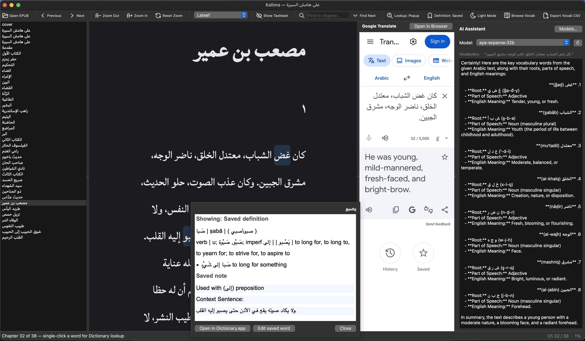

<div align="center">

# كلمة · Kalima

**An Arabic EPUB reader for macOS built for learners**

Dictionary lookup · AI analysis · Vocabulary management · Anki export

[](https://www.apple.com/macos/)
[](https://www.python.org/)
[](https://www.riverbankcomputing.com/software/pyqt/)

<br>



</div>

---

## What is Kalima?

Kalima (كلمة, "word") is a native macOS application for reading Arabic EPUB books. It's designed for Arabic learners who want to look up words, save vocabulary, and use AI tools — all without leaving the reader.

> **Note:** Kalima is macOS-only. Dictionary lookup uses the native macOS Dictionary Services API.

---

## Features

### 📖 Reader
- Opens any standard `.epub` file
- Chapter sidebar with full table of contents
- Previous / Next chapter navigation
- Zoom in and out
- **Dark mode** toggle
- **18 bundled Arabic fonts** — switchable from the toolbar (Amiri, Scheherazade, Noto Naskh, Cairo, and more)
- Toggle Arabic **tashkeel** (diacritical marks) on or off
- Find in chapter (`⌘G`)
- Remembers the last-read chapter and scroll position per book
- Recent files menu

### 🔍 Dictionary Lookup
- **Single-click** any word to open an in-app popup with the macOS Arabic dictionary definition
- **Double-click** to look up the selected text
- Toggle between **in-app popup** and **macOS Dictionary.app** modes
- Toggle between the **live dictionary** result and your **saved definition**
- Saved words are **highlighted in blue** throughout the chapter

### 🤖 AI Tools
Right-click any selected text for instant AI actions:

| Action | What it does |
|---|---|
| **Translate** | Arabic → English translation |
| **Explain** | Meaning, tone, and context in English |
| **Explain Simply in Arabic** | Plain-language Arabic explanation |
| **Vocabulary** | Key words with roots and definitions |
| **Grammar** | Verb forms, noun cases, sentence structure |
| **Morphology** | Root (جذر), pattern (وزن), word category |
| **Add Tashkīl** | Returns the text with full diacritical marks |
| **Simplify Arabic** | Rewrites in accessible Modern Standard Arabic |
| **Make Anki Cards** | Generates ready-to-import flashcards |
| **Ask Custom Prompt…** | Your own prompt, with `{text}` as a placeholder |

AI responses stream in a **resizable sidebar panel** powered by [Ollama](https://ollama.com) (runs locally — no API key or internet required after setup).

**Right-click also gives you:**
- **Translate on Google** — opens Google Translate in the browser or in an in-app panel
- **Ask Claude** — opens [claude.ai](https://claude.ai) with a pre-filled translation + vocabulary prompt
- **Ask ChatGPT** — same, on [chatgpt.com](https://chatgpt.com)
- **Copy** — reliable clipboard copy even where the browser blocks it

All AI prompts live in [`assets/prompts.json`](assets/prompts.json) — edit or add prompts without touching any code.

### 📚 Vocabulary
- Save any word with an **editable definition** and optional **note**
- Full **Vocabulary Browser** — search, edit, and delete entries
- Vocabulary is stored locally in SQLite (`~/Library/Application Support/Kalima/`)
- **Export to CSV** for spreadsheet use
- **Export to Anki (.apkg)** — one click creates a deck you can double-click to import into Anki
  - Cards are keyed by word so **re-exporting updates existing notes** rather than creating duplicates
  - Each book becomes a `Kalima :: Book Title` subdeck automatically

---

## Installation

### Option A — One command (recommended for most users)

Paste this into Terminal. It installs Homebrew, Python 3.12, and all dependencies automatically:

```bash
/bin/zsh -c "$(curl -fsSL https://raw.githubusercontent.com/jahedev/kalima/refs/heads/main/install.sh)"
```

### Option B — Manual setup

```bash
git clone https://github.com/jahedev/kalima.git
cd kalima
python3 -m venv .venv
source .venv/bin/activate
pip install -r requirements.txt
python guiapp.py
```

### Option C — Pre-built app (macOS only)

Download the latest `.dmg` from [Releases](https://github.com/jahedev/kalima/releases), open it, and drag **Kalima.app** to your Applications folder. Available for both Apple Silicon and Intel.

---

## AI Setup (optional)

The AI sidebar requires [Ollama](https://ollama.com) running locally.

```bash
# Install via Homebrew
brew install ollama

# Start the server
ollama serve
```

Then pull a model. Recommended in order of quality:

| Model | RAM needed | Notes |
|---|---|---|
| `aya-expanse:32b` | ~20 GB | Best Arabic quality; requires 36 GB+ unified memory |
| `gemma3:27b` | ~18 GB | Excellent; M1/M2 Pro or Max with 16 GB+ |
| `jwnder/jais-adaptive:7b` | ~5 GB | Good Arabic support; works on any Mac with 8 GB+ |
| `gemma4:e4b` | ~3 GB | Lightweight; fastest but less accurate on complex text |

```bash
ollama pull gemma3:27b
```

> Smaller models are faster but less accurate on classical prose, poetry, and morphological analysis. The app's **Models…** button can pull any of these for you.

---

## macOS Dictionary Setup

For the best dictionary results, enable the Arabic dictionary in macOS:

1. Open **Dictionary.app**
2. Go to **Dictionary → Settings**
3. Enable **Arabic – English** (Oxford Arabic Dictionary)
4. Move it higher in the list for priority

---

## Keyboard Shortcuts

| Shortcut | Action |
|---|---|
| `⌘ O` | Open EPUB |
| `← →` | Previous / Next chapter |
| `⌘ +` / `⌘ -` | Zoom in / out |
| `⌘ G` | Find next in chapter |
| `⌘ ⇧ V` | Vocabulary Browser |
| `⌘ ⇧ A` | Show / hide AI panel |
| `⌘ ⇧ T` | Toggle Google Translate panel |
| `⌘ ⇧ H` | Toggle tashkeel |
| `⌘ ⇧ D` | Toggle dark mode |
| `⌘ ⇧ L` | Toggle lookup mode |

---

## Building the App

A GitHub Actions workflow builds and packages signed `.dmg` files for both Apple Silicon and Intel on every version tag:

```bash
git tag v1.0.0
git push --tags
```

To build locally:

```bash
pip install pyinstaller
pyinstaller kalima.spec --noconfirm
# Output: dist/Kalima.app
```

---

## Requirements

- macOS 12 Monterey or later
- Python 3.12
- Dependencies: `PyQt6`, `PyQt6-WebEngine`, `ebooklib`, `beautifulsoup4`, `lxml`, `genanki`
- Optional: `pyobjc-framework-DictionaryServices` (for dictionary lookup)
- Optional: [Ollama](https://ollama.com) (for AI features)

---

## License

MIT
